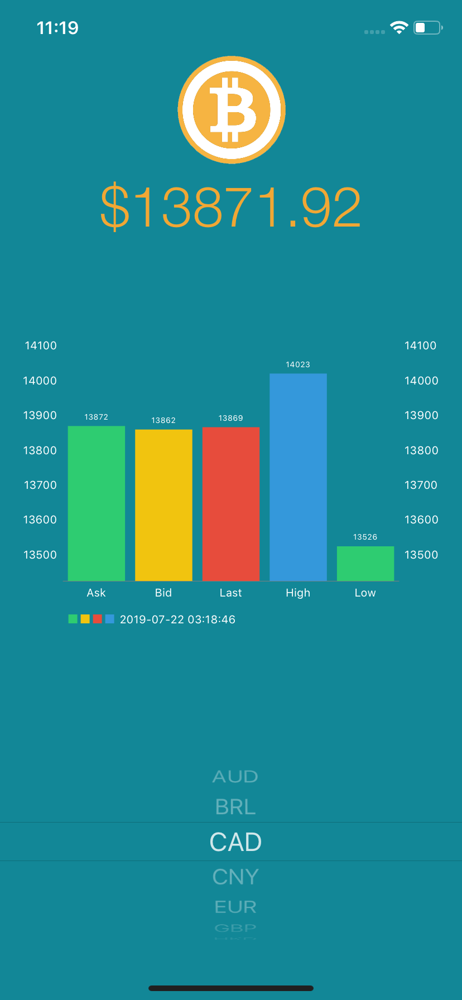
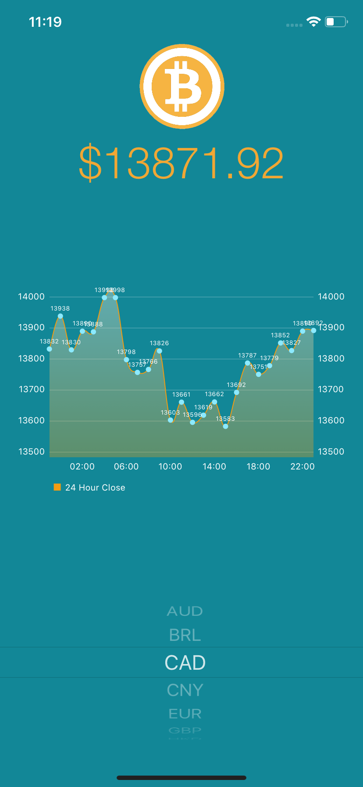

# bitcoin-conversion-app

A simple iOS app that allows the user to perform a 1:1 price conversion between Bitcoin (BTC) and other international currencies [Data source: https://bitcoinaverage.com]. Displays the conversions in a bar chart showing the ask, bid, last, high, and low price point, with a time stamp of when the data was last retrieved. Swiping left displays a second screen with a 24-hour historical price index of the selected currency [Data source: https://www.cryptocompare.com].

